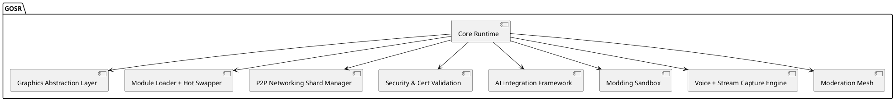
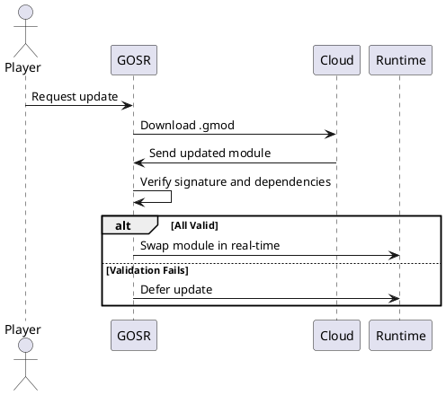
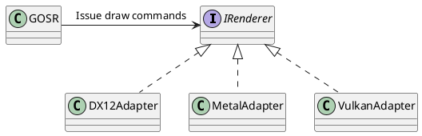
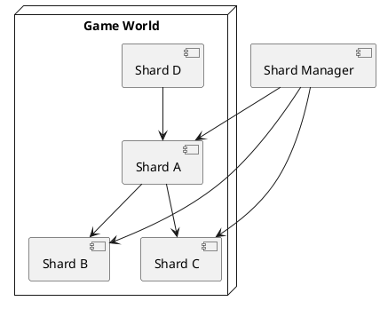
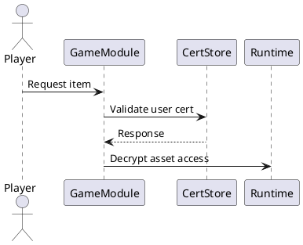
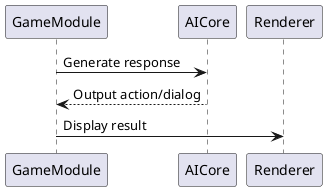
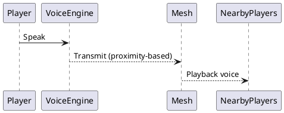
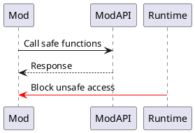
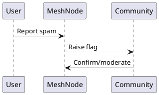
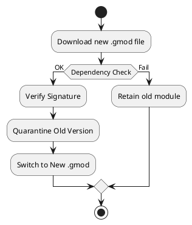

# GOSR (Game Operating System Runtime) - Technical Specification

## Overview
GOSR is a modular, system-level runtime designed to revolutionize how games run across all platforms. It abstracts away hardware and OS fragmentation, enabling consistent, fast, and secure gameplay with dynamic hot-swapping, peer-to-peer networking, real-time updates, and AI-native capabilities.

## Goals
- Enable universal compatibility across CPU architectures (ARM, x86, etc.)
- Eliminate downtime via modular hot-swapping updates
- Improve accessibility for smaller studios
- Support peer-to-peer networking with shard logic for massive multiplayer experiences
- Embed anti-piracy, moderation, and AI tools at the system layer
- Abstract rendering, input, voice, and streaming away from native APIs

## Architecture

## Key Components

### 🧠 Module Loader + Hot Swapper

- Game content split into GOSR Modules (.gmod)
- Versioned and dependency tracked
- Hot-swapped at runtime, rollback safe
- Streams downloads while game is running
- Old versions quarantined until verified
- Supports live-patching without interrupting gameplay
- Dependency graph ensures all submodules are compatible before switching

### 🎮 Graphics Abstraction Layer

- GOSR issues rendering commands in a unified format
- Translates dynamically to DirectX, Metal, Vulkan, WebGPU, etc.
- GPU vendor driver handles optimization layer
- Avoids double abstraction by batching GPU commands per frame
- GPU drivers only responsible for IRenderer tuning layer
- Enables future-proof support for new platforms

### 🌐 P2P Networking & Sharding

- World divided into micro-shards (regional cells)
- Only adjacent shards communicate directly
- Shards replicate across peers based on reliability and latency
- Redundant nodes hold backup state
- DDoS mitigation by offloading load and dynamically re-sharding
- Connection priority assigned via adaptive quality-of-service metrics
- Bandwidth managed via predictive throttling

### 🔐 Security & Certificate Layer

- All GOSR modules cryptographically signed
- Signed content linked to developer identity
- Purchase receipts and entitlement certs stored per-user
- Secure Module Store protects user items
- DRM logic is centralized and cannot be bypassed by modded clients
- Certificates can be revoked in case of compromise

### 🧬 AI Runtime Integration

- Built-in hooks for:
  - LLM-powered NPC dialog
  - AI-assisted map generation
  - Dynamic quest logic
- Uses AI modules deployable on-device or streamed
- Fast lane access to hardware-accelerated AI cores
- Sandboxable prompts with embedded safety tokens
- Real-time prompt tuning based on user behavior

### 🎙 Voice + Stream Engine

- Captures render frames before GPU final output
- Transmits compressed H.264/AV1 to Twitch/YouTube or disk
- P2P mesh voice relaying (proximity-based)
- Voice chat encrypted, obfuscated against man-in-the-middle
- Developer opt-in SDK for audio filters and watermarking

### 🧵 Modding Sandbox

- Developer-defined mod API surface
- Mods run in sandboxed thread-space
- Mods verified and versioned with rollback support
- Can only call exposed whitelisted interfaces
- Zero access to DRM, AI prompts, certs, or P2P layer
- Mods hot-swappable at runtime, like .gmods

### 👮 Moderation Mesh

- Moderation is decentralized
- Moderation power is trust-weighted based on past actions
- Every game can define its moderation policy schema
- Global abuse database tracks pattern behavior
- Developers not liable for user-led moderation under fair-play clause

## Update Flow

## Next Steps
- Implement GOSR simulation kernel in Rust
- Create GOSR .gmod packager CLI
- Build testbed demo game
- Reach out to chip vendors and indie studios
